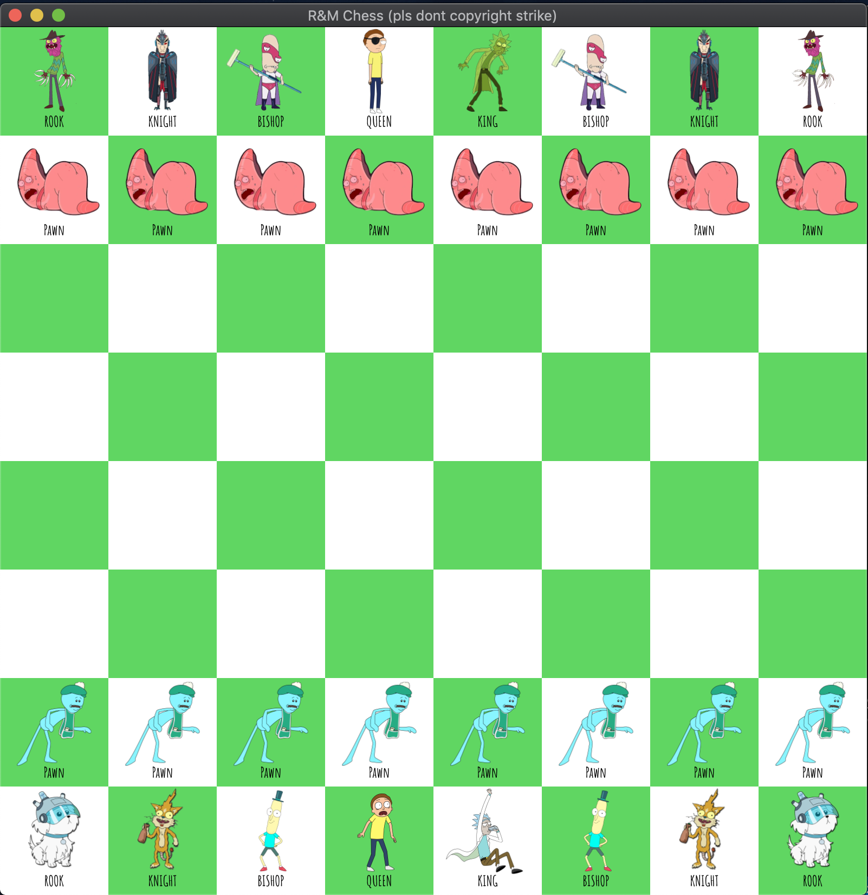
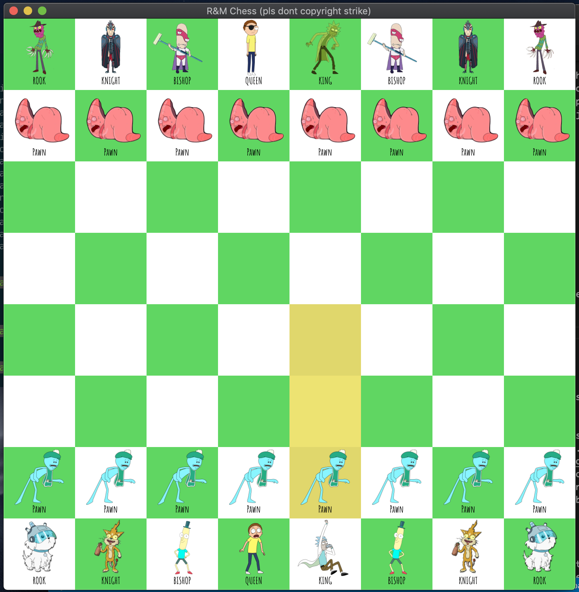
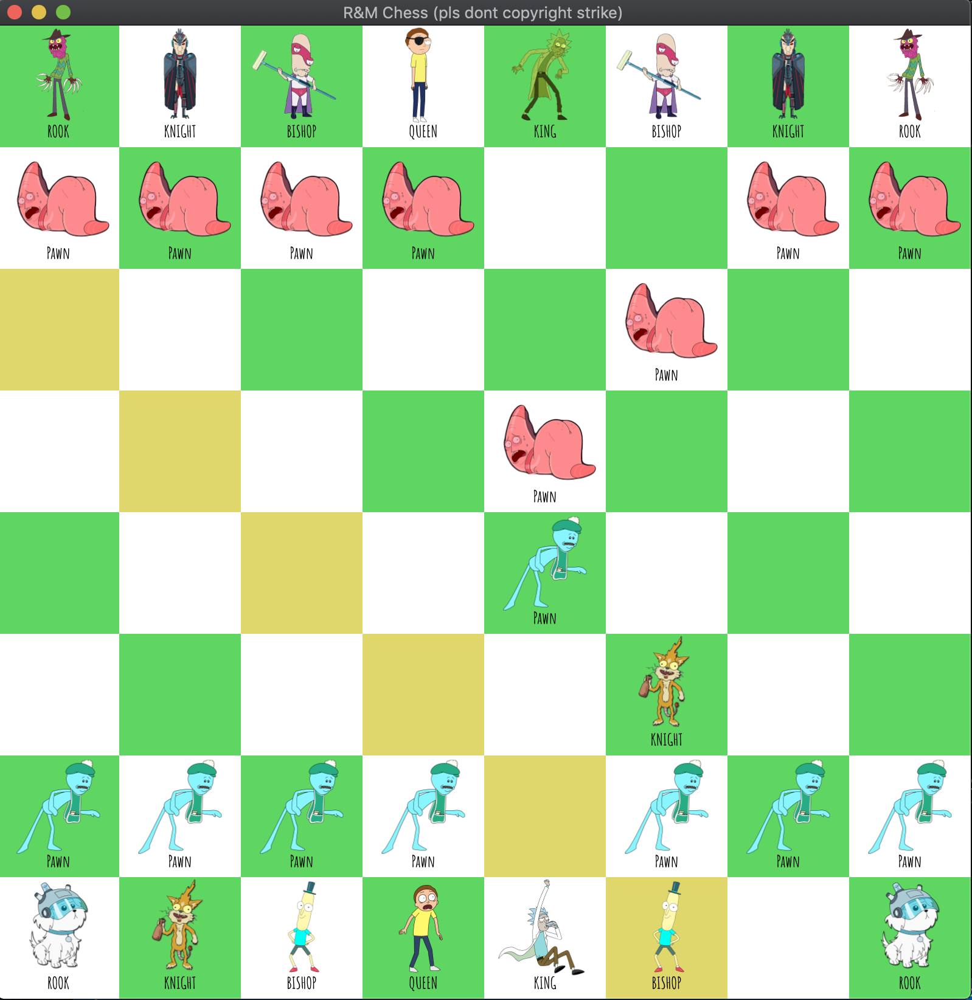
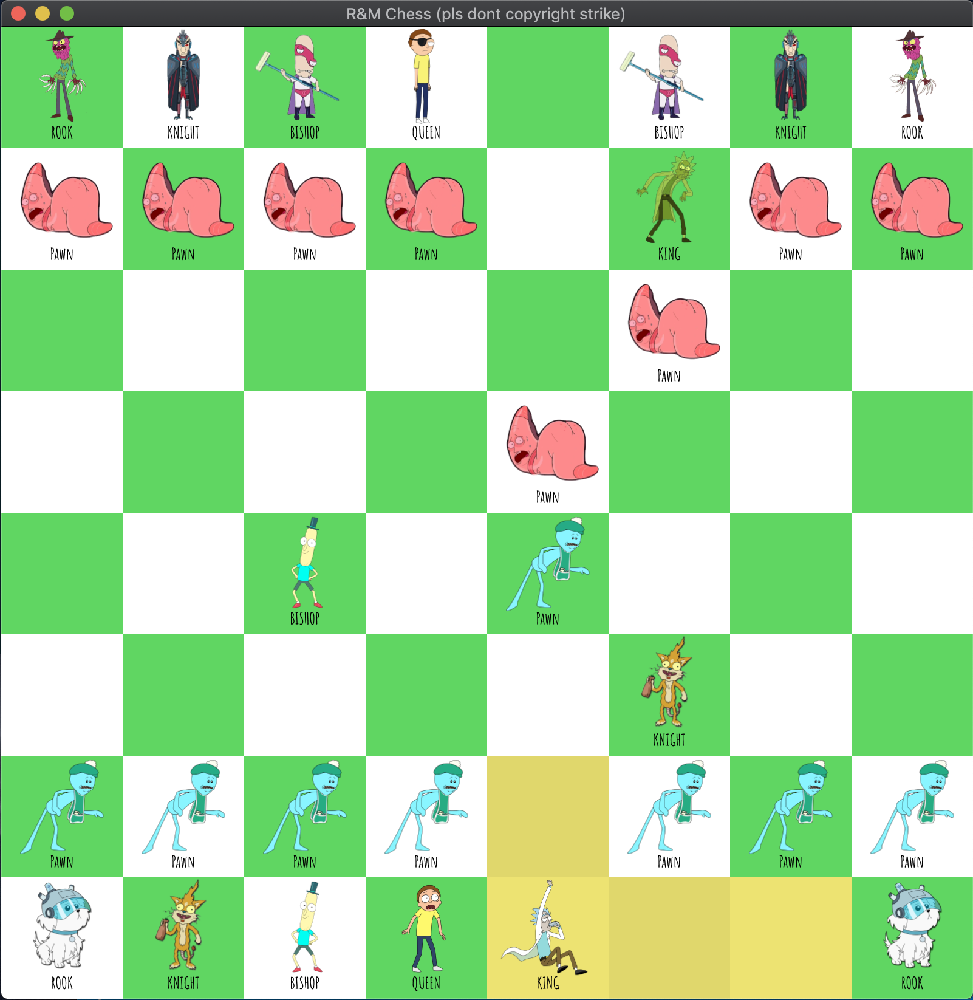
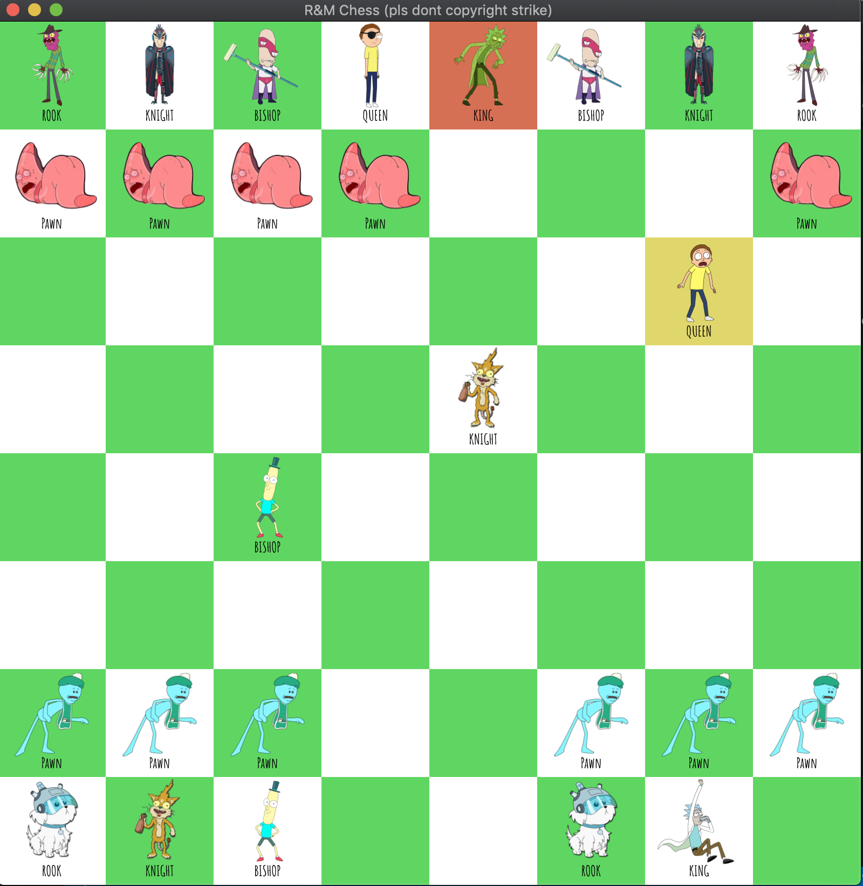
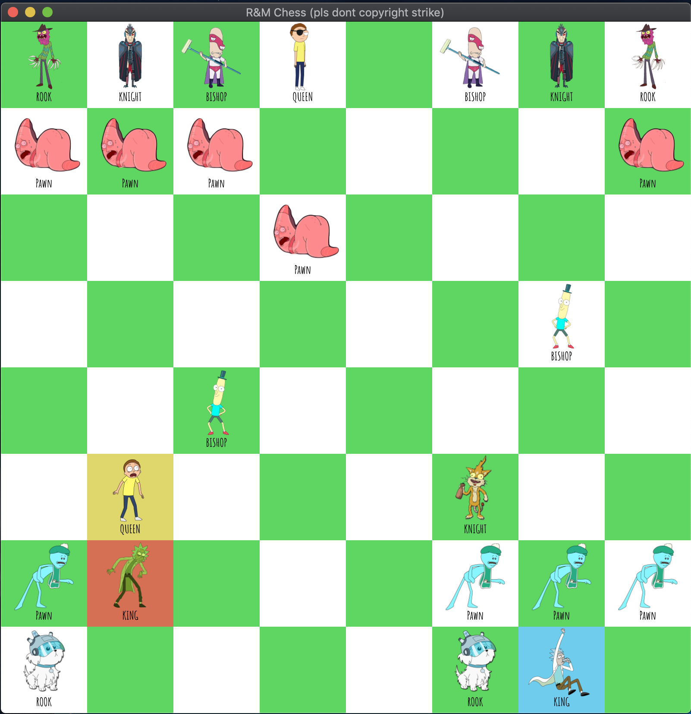

# Rick and Morty Chess

First of all please don't copyright strike this for the Rick and Morty stuff ~ this is still a prototype version of a larger game of Chess I am trying to build.

The motivation for building this game is that the version of Chess installed by default onto my Macbook is not the greatest, and I attempted to build a much better version, as an avid Chess player. I also want to eventually a port the logic I have built within this project to a mobile application, so I can enjoy playing chess without having dozens of advertisements popping up.

## Roadmap

- [X] Build class heirarchies (to practice CS 138 Concepts)
- [X] Build basic Chess Engine
- [X] P.O.C. Chess Game using the Command Line
- [X] 2D Rendering and handling user input
- [ ] 3D Rendering using OpenGL
- [ ] Adding an AI or Chess-bot algorithm

## Gallery

Here are some images of the gameplay highlighting a few features. [Here](https://youtu.be/BLAd2kaJCn0) is a link to a YT video demonstrating live gameplay.

## Challenge(s)

The greatest challenge I faced wasn't the actual building, but the debugging. As I chose to work with C++ and raw pointers, there were several instances of segmentation faults that I experienced when testing (check out my commit history if you don't believe me). Although I was eventually able to solve most of them, I still occasionally experience a corrupted memory issue. After some research, I suspect that it may be because of the library I'm using (SFML). Link to my research can be found [here](https://en.sfml-dev.org/forums/index.php?topic=19718.0). Other individuals are experiencing this issue because their version of SFML is not up-to-date. Unfortunately, my installation method required using `brew` due to previous installation failures, and as such, I'm not able to obtain an alternate supported version of this library. For now, further investigating this problem aligns with the Law of Diminishing Returns.

## Replicate

Note: This platform has been developed on a Mac and as a result, has not been confirmed to support Windows machines. Furthermore, this is the installation process that worked for me and may not work for other machines.

If you would like to demo this app for now, you can follow the guide below:

Install SFML:

`brew install sfml` or `sudo apt-get install libsfml-dev`

Clone the repository:

`git clone https://github.com/nathantau/Chess.git`

Navigate to source directory:

`cd src`

Compile the project using *Make*:

`make`

Run the executable:

`./chess`
